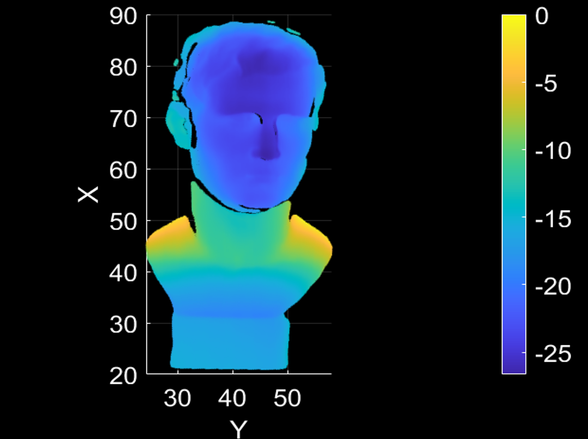

# Structured Light 3D Reconstruction

This project implements a 3D reconstruction system based on structured light using the following techniques:

- **N-step Phase-Shifting**  
- **Three-Frequency Heterodyne Method**  
- **Eight-Parameter Depth Decoding Model**

